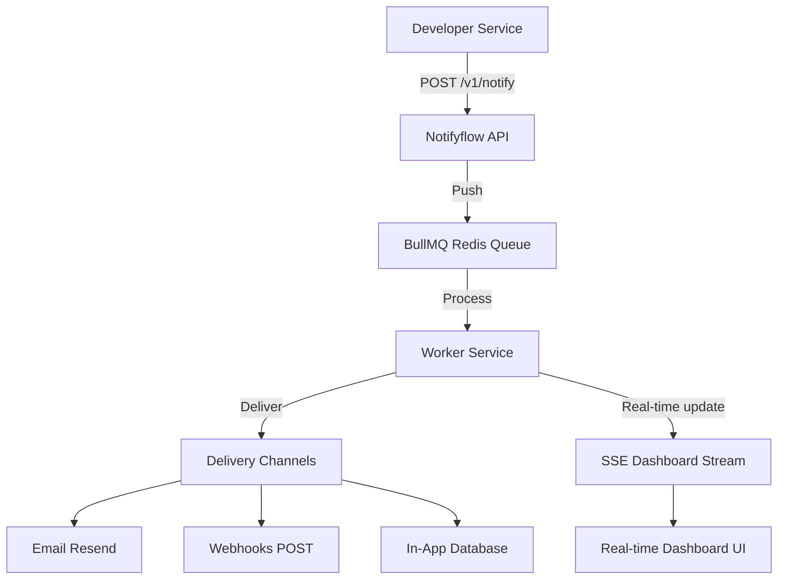

Notifyflow is an open-source, high-performance multi-channel notification infrastructure designed for modern developer teams. Rather than hardcoding delivery configurations directly in your applications or wrapping multiple vendor SDKs, Notifyflow acts as a unified gateway for all your transactional notifications.

## The Problem
As application codebases grow, managing notifications becomes complex:
* **Vendor Lock-in:** Code is tightly coupled to Resend, SendGrid, Twilio, or other APIs.
* **Reputation & Delivery Risks:** Using shared or managed IP pools can result in delivery failures if another customer misbehaves.
* **Lack of Visibility:** It's hard to trace whether a notification actually reached a recipient, failed, or was retried.
* **Complex Orchestration:** Building retry queues, dead-letter loops, and rate limiters from scratch takes weeks.

## The BYOK (Bring Your Own Keys) Solution
Notifyflow solves this by adopting a **Bring Your Own Keys (BYOK)** architecture. You get the developer experience of a managed API gateway while retaining absolute control over your keys, sending reputation, and provider configurations.

## Core Strengths
* **One Unified Endpoint:** Dispatch Email, Webhooks, In-App feeds, and SMS via a single payload schema.
* **High-Throughput Queueing:** Powered by Redis and BullMQ, handling high traffic volumes without slowing down client threads.
* **Intelligent Retry Pipeline:** Failed dispatches automatically undergo 4 retry attempts with exponential backoff before landing in a Dead-Letter Queue (DLQ).
* **Zero Overhead:** No heavy SDK packages required. Control everything via standardized JSON API payloads.

<Card title="Quickstart Guide" icon="bolt" href="/quickstart">
  Learn how to send your first notification in under 10 minutes.
</Card>
